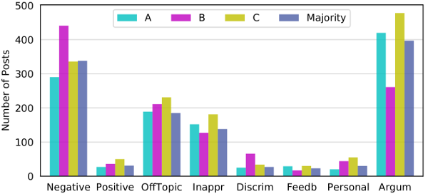
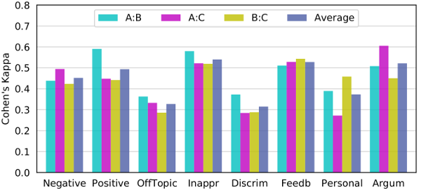

# One Million Posts Corpus

### A Data Set of German Online Discussions

This is the home of the "One Million Posts" corpus, an annotated data set consisting of user comments posted to an Austrian newspaper website (in German language).

This data set will be presented as a short paper at the [40th International ACM SIGIR Conference on Research and Development in Information Retrieval](http://sigir.org/sigir2017/) (SIGIR 2017). See the [Citation section](#citation) below.

## Data Set Description

[DER STANDARD](http://derstandard.at) is an Austrian daily broadsheet newspaper. On the newspaper's website, there is a discussion section below each news article where readers engage in online discussions. The data set contains a selection of user posts from the 12 month time span from 2015-06-01 to 2016-05-31. There are 11,773 labeled and 1,000,000 unlabeled posts in the data set. The labeled posts were annotated by professional forum moderators employed by the newspaper.

The data set contains the following data for each post:

* **Post ID**
* **Article ID**
* **Headline** (max. 250 characters)
* **Main Body** (max. 750 characters)
* **User ID** (the user names used by the website have been re-mapped to new numeric IDs)
* **Time stamp**
* **Parent post** (replies give rise to tree-like discussion thread structures)
* **Status** (online or deleted by a moderator)
* **Number of positive votes** by other community members
* **Number of negative votes** by other community members

For each article, the data set contains the following data:

* **Article ID**
* **Publishing date**
* **Topic Path** (e.g.: Newsroom / Sports / Motorsports / Formula 1)
* **Title**
* **Body**

The data is provided in the form of an [SQLite](https://www.sqlite.org/) database file. See also the commented [database schema](https://github.com/OFAI/million-post-corpus/blob/master/database_schema.md).

Detailed descriptions of the post selection and annotation procedures are given in the paper.

### Annotated Categories

Potentially undesirable content:

* **Sentiment** (negative/neutral/positive)  
An important goal is to detect changes in the prevalent sentiment in a discussion, e.g., the location within the fora and the point in time where a turn from positive/neutral sentiment to negative sentiment takes place.
* **Off-Topic** (yes/no)  
Posts which digress too far from the topic of the corresponding article.
* **Inappropriate** (yes/no)  
Swearwords, suggestive and obscene language, insults, threats etc.
* **Discriminating** (yes/no)  
Racist, sexist, misogynistic, homophobic, antisemitic and other misanthropic content.

Neutral content that requires a reaction:

* **Feedback** (yes/no)  
Sometimes users ask questions or give feedback to the author of the article or the newspaper in general, which may require a reply/reaction.

Potentially desirable content:

* **Personal Stories** (yes/no)  
In certain fora, users are encouraged to share their personal stories, experiences, anecdotes etc. regarding the respective topic.
* **Arguments Used** (yes/no)  
It is desirable for users to back their statements with rational argumentation, reasoning and sources.

Several of these categories are based on respective rules in the [community guidelines of the website](http://derstandard.at/2934632/Forenregeln-Community-Richtlinien).

## Statistics

The following table contains some relevant statistics for the data set.

<table>
<tr><td>Total number of posts</td><td style="text-align: right;">1,011,773</td></tr>
<tr><td>Number of unlabeled posts</td><td style="text-align: right;">1,000,000</td></tr>
<tr><td>Number of labeled posts</td><td style="text-align: right;">11,773</td></tr>
<tr><td>Number of category annotation decisions</td><td style="text-align: right;">58,568</td></tr>
<tr><td>Number of posts taken offline by moderators</td><td style="text-align: right;">62,320</td></tr>
<tr><td>Min/Median/Max post length (words)</td><td style="text-align: right;">0 / 21 / 500</td></tr>
<tr><td>Vocabulary size (≥ 5 occurrences)</td><td style="text-align: right;">129,070</td></tr>
<tr><td>Number of articles</td><td style="text-align: right;">12,087</td></tr>
<tr><td>Number of article topics</td><td style="text-align: right;">1,229</td></tr>
<tr><td>Number of users</td><td style="text-align: right;">31,413</td></tr>
<tr><td>Min/Median/Max number of posts per article</td><td style="text-align: right;">1 / 22 / 3,656</td></tr>
<tr><td>Min/Median/Max number of posts per topic</td><td style="text-align: right;">1 / 142 / 44,329</td></tr>
<tr><td>Min/Median/Max number of posts per user</td><td style="text-align: right;">1 / 5 / 4,682</td></tr>
<tr><td>Min/Median/Max number of users per article</td><td style="text-align: right;">1 / 15 / 1,371</td></tr>
<tr><td>Min/Median/Max number of users per topic</td><td style="text-align: right;">1 / 78 / 6,874</td></tr>
<tr><td>Number of pos./neg. community votes</td><td style="text-align: right;">3,824,806 / 1,096,300</td></tr>
</table>

The following table gives the number of labeled examples per category.

| Category | Does Apply | Does Not Apply | Total | Percentage |
| --- | ---: | ---: | ---: | ---: |
| Sentiment Negative | 1691 | 1908 | 3599 | 47 % |
| Sentiment Neutral | 1865 | 1734 | 3599 | 52 % |
| Sentiment Positive | 43 | 3556 | 3599 | 1 % |
| Off-Topic | 580 | 3019 | 3599 | 16 % |
| Inappropriate | 303 | 3296 | 3599 | 8 % |
| Discriminating | 282 | 3317 | 3599 | 8 % |
| Possibly Feedback | 1301 | 4737 | 6038 | 22 % |
| Personal Stories | 1625 | 7711 | 9336 | 17 % |
| Arguments Used | 1022 | 2577 | 3599 | 28 % |

In the first annotation round, three moderators annotated 1,000 randomly selected posts. From this subset of the data, we can estimate the category distributions. The following bar chart shows the distribution for the three annotators (A, B, C) and after a majority vote per post.



Furthermore, this subset can be used to compute [Cohen's Kappa](https://en.wikipedia.org/wiki/Cohen's_kappa) values to quantify the inter-rater agreement. The following bar chart shows the agreement for each pair of moderators and the average across all pairs for each category.



## License

This data set is licensed under a [Creative Commons Attribution-NonCommercial-ShareAlike 4.0 International License](http://creativecommons.org/licenses/by-nc-sa/4.0/).

[](http://creativecommons.org/licenses/by-nc-sa/4.0/)

## Citation

The data set was first presented at [SIGIR 2017](http://sigir.org/sigir2017/):

> Dietmar Schabus, Marcin Skowron, Martin Trapp  
**One Million Posts: A Data Set of German Online Discussions**  
Proceedings of the 40th International ACM SIGIR Conference on Research and Development in Information Retrieval (SIGIR)  
Tokyo, Japan, August 2017

Please cite this paper if you use the data set (BibTex below). You can download a [preprint version of the paper here](https://github.com/OFAI/million-post-corpus/raw/gh-pages/assets/SIGIR_2017_preprint.pdf). The definitive version of the paper will be available under DOI [10.1145/3077136.3080711](http://dx.doi.org/10.1145/3077136.3080711).

```
@InProceedings{Schabus2017,
  Author    = {Dietmar Schabus and Marcin Skowron and Martin Trapp},
  Title     = {One Million Posts: A Data Set of German Online Discussions},
  Booktitle = {Proceedings of the 40th International ACM SIGIR Conference on Research and Development in Information Retrieval (SIGIR)},
  Year      = {2017 (accepted)},
  Address   = {Tokyo, Japan},
  Month     = aug
}
```
## Experiments

The code and instructions to reproduce the experimental results presented in the paper can be found in the [experiments folder in the GitHub repository](https://github.com/OFAI/million-post-corpus/tree/master/experiments).

## Acknowledgments

This research was partially funded by the [Google Digital News Initiative](https://www.digitalnewsinitiative.com). We thank [DER STANDARD](http://derstandard.at) and their moderators for the interesting collaboration and the annotation of the presented corpus. The GPU used for this research was donated by [NVIDIA](https://developer.nvidia.com/academic_gpu_seeding).
